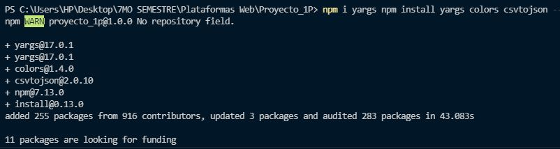

## UNIVERSIDAD POLITECNICA SALESIANA
## Asignatura: Plataformas Web
## Autor: Joel Yunga
## Emai: jyungap1@est.ups.edu.ec

# Aplicación en NodeJS que permita leer los datos de las Suscripciones a telefonía celular móvil

_Crear una aplicación en NodeJS que permita leer los datos de las suscripciones a telefonía celular móvil, publicadas por el Banco
Mundial y publicar las estadísticas de un determinado país en un año específico._

### Pre-requisitos 📋

_Software que necesitas instalar._

```
Visual Studio Code
Node.js® 
```

_Librerias que necesitas instalar._

```
yargs
colors
csvtojson
```
_Archivos adicionales._
```
API_IT.CEL.SETS_DS2_es_csv_v2_2278396.csv
```
### Instalación 🔧

_Los programas necesesarios para la realización del software son Visual Studio Code y NodeJS_

_En el siguiente link se encuentra una facil instalacion de Visual Studio Code_

_https://www.mclibre.org/consultar/informatica/lecciones/vsc-instalacion.html_

_Por ultimo se encuentra un link para la instalacion de NodeJS para los diferentes sistemas operativos_

_https://desarrolloweb.com/articulos/instalar-node-js.html#:~:text=Instalaci%C3%B3n%20de%20NodeJS%20en%20Windows,instalador%20y%20%C2%A1ya%20lo%20tienes!_

### Instalacion de libreria yargs, colors, csvtojson. 🔧

_Ingresa a la terminal de Visual Studio Code y digita:_

```
npm install yargs colors csvtojson --save
```


