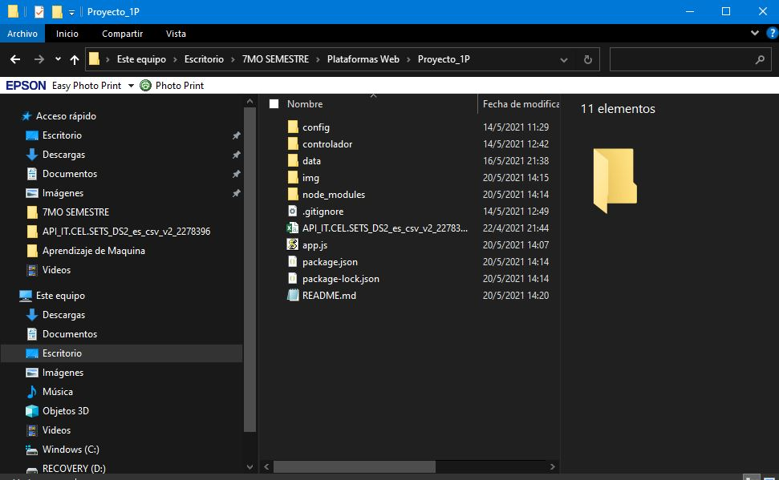
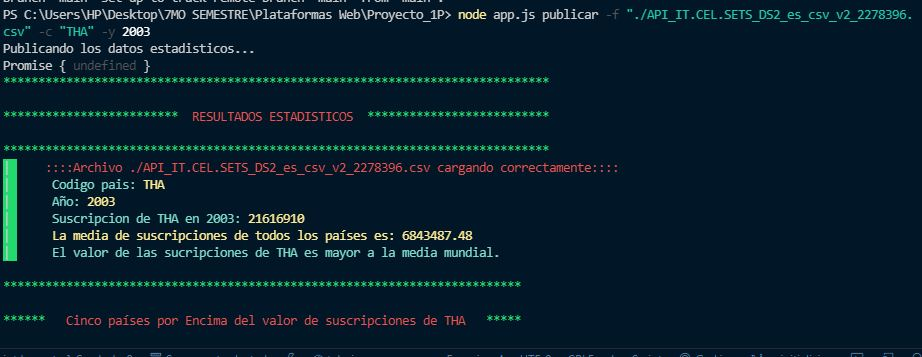
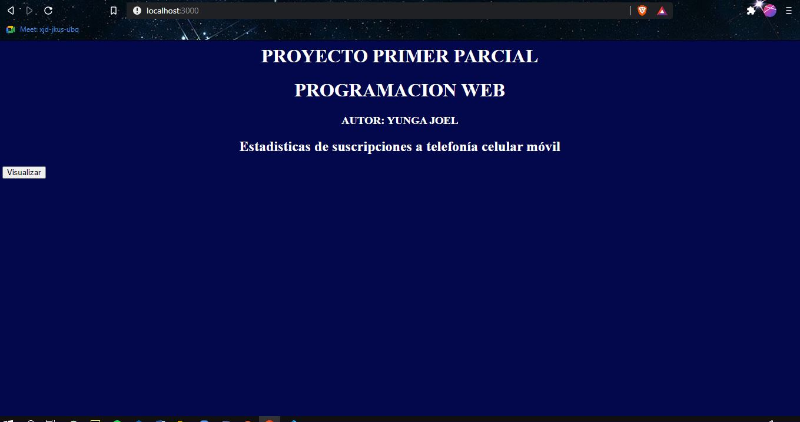
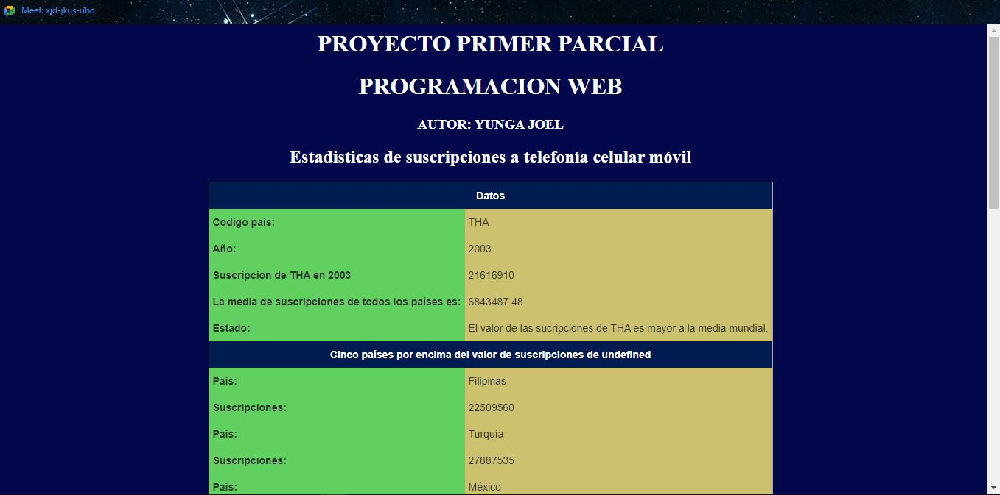
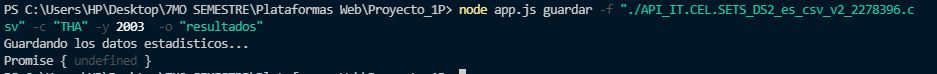
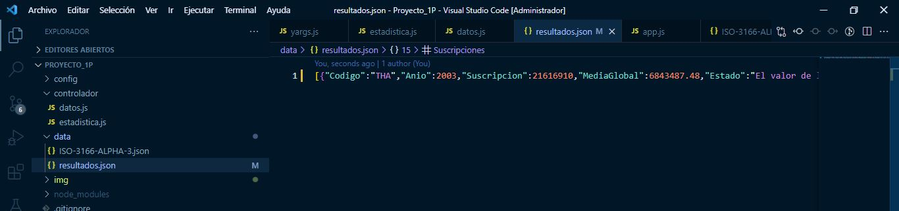

## UNIVERSIDAD POLITECNICA SALESIANA
## Asignatura: Plataformas Web
## Autor: Joel Yunga
## Emai: jyungap1@est.ups.edu.ec

# Aplicación en NodeJS que permita leer los datos de las Suscripciones a telefonía celular móvil

_Crear una aplicación en NodeJS que permita leer los datos de las suscripciones a telefonía celular móvil, publicadas por el Banco
Mundial y publicar las estadísticas de un determinado país en un año específico._

### Pre-requisitos 📋

_Software que necesitas instalar._

```
Visual Studio Code
Node.js® 
```

_Librerias que necesitas instalar._

```
yargs
colors
csvtojson
```
_Archivos adicionales._
```
API_IT.CEL.SETS_DS2_es_csv_v2_2278396.csv
```
### Instalación 🔧

_Los programas necesesarios para la realización del software son Visual Studio Code y NodeJS_

_En el siguiente link se encuentra una facil instalacion de Visual Studio Code_

_https://www.mclibre.org/consultar/informatica/lecciones/vsc-instalacion.html_

_Por ultimo se encuentra un link para la instalacion de NodeJS para los diferentes sistemas operativos_

_https://desarrolloweb.com/articulos/instalar-node-js.html#:~:text=Instalaci%C3%B3n%20de%20NodeJS%20en%20Windows,instalador%20y%20%C2%A1ya%20lo%20tienes!_

### Instalacion de libreria yargs, colors, csvtojson. 🔧

_Ingresa a la terminal de Visual Studio Code y digita:_

```
npm install yargs colors csvtojson --save
```


_DATASET._

_Ingresa al siguiente link: https://datos.bancomundial.org/indicador/IT.CEL.SETS_ y se descarga el archivo CSV

```
Descomprime el archivo API_IT.CEL.SETS_DS2_es_csv_v2_1004854.csv en la carpeta raiz del proyecto
```


## PRUEBAS ⚙️

La aplicacion cuenta con 2 comandos:
* Publicar
* Guardar

**Publicar**

La estructura para publicar en la aplicacion es la sigueinte:
node app.js publicar **-f** "nombre_archivo.csv" **-c** "[codigo_del_pais ](https://laendercode.net/es/3-letter-list.html)" **-y** Año

```
Ejemplo:
node app.js publicar -f "./API_IT.CEL.SETS_DS2_es_csv_v2_2278396.csv" -c "THA" -y 2003
```


Para visualizar los resultados en la web se debe seguir los siguientes pasos:

```
Abra su navegador digite en la seccion de url: localhost:3000
```


```
De Click en Ver Datos
```


**Guardar**

La estructura para guardar en la aplicacion es la siguiente:
node app.js guardar **-f** "nombre_archivo.csv" **-c** "[codigo_del_pais ](https://laendercode.net/es/3-letter-list.html)" **-y** Año **-o** "nombre_archivo_sin_extension"

```
Ejemplo:
node app.js guardar -f "./API_IT.CEL.SETS_DS2_es_csv_v2_2278396.csv" -c "THA" -y 2003  -o "resultados"
```


Puede revisar los datos guardados en ela carpeta data y en el archivo resultados.json



## Construido con 🛠️

* [Visual Studio Code](https://code.visualstudio.com/) - Editor de código fuente.
* [Node js](https://nodejs.org/es/) - Entorno de ejecución para JavaScript.
* [GitHub](https://github.com/)  - Repositorio


